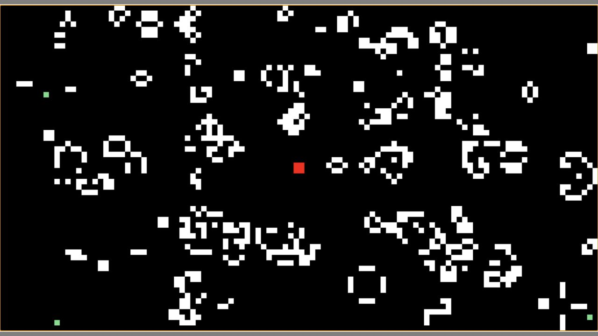

# Cellular Cube Go / 细胞方块漫游

## [▶ 在线游玩（推荐）](https://zh3zhou.github.io/Cellular-Cube-Go/)

在持续演化的元胞自动机中控制红色方块生存。白色细胞是危险；触碰并离开彩色奖励，会在移动方向前方生成一座使用不同规则的隔离温室。彩色孵化细胞可以穿过且不会致死，成熟后则变为白色、并入 Conway 主世界。



### 操作

| 按键 | 功能 |
| --- | --- |
| `W` `A` `S` `D` | 移动红色方块 |
| `P` | 暂停 / 继续 |
| `R` | 游戏结束后重开 |
| `Esc` | 打开 / 关闭设置 |
| 设置内 `W/S` | 选择项目 |
| 设置内 `A/D` | 调整数值 |
| 设置内 `Enter/Space` | 切换开关 |

主世界始终使用硬边界、二值 Conway Life。最多同时存在三座互不重叠且相隔一格的温室；外面的 Conway 细胞不能侵入。温室稳定、灭绝或达到代数上限后结束，仍存活的结构成为普通白色细胞，也会恢复致死碰撞。

## 五种奖励生态

| 颜色 | 规则 | 规则式 / 邻域 | 游戏中的性格 |
| --- | --- | --- | --- |
| 绿色 | Conway Life | `B3/S23`，Moore 8 邻域 | 主世界规则；奖励概率永不低于 55% |
| 紫色 | HighLife | `B36/S23`，Moore 8 邻域 | 额外的六邻居出生支持复制结构 |
| 橙色 | Seeds | `B2/S`，Moore 8 邻域 | 活细胞立即死亡，新生快速爆发 |
| 青蓝色 | Day & Night | `B3678/S34678`，Moore 8 邻域 | 活/死反转对称，容易形成浓密边界 |
| 黄色 | Wolfram Code 52 | `B24/S134`，von Neumann 4 邻域 | 十字晶格中的周期块、移动边界与复杂局部结构 |

绿色先保留 55%。剩余 45%按各副规则当前可用 Pattern 数量的平方根分配；若某规则暂时没有足够的新 Pattern，份额自动回流绿色。因此绿色通常会高于 55%，副规则扩库也不会突然淹没主玩法。

Code 52 的规则选择参考了 Packard/Wolfram 的[二维元胞自动机研究](https://content.wolfram.com/sw-publications/2020/07/two-dimensional-cellular-automata.pdf)与后续的[复杂行为研究](https://www.complex-systems.com/abstracts/v17_i02_a05/)。论文只用于规则灵感和技术说明，目录没有复制论文图像。

## 复杂度会随游戏成长

开局优先提供紧凑、可读的 Pattern。进程同时考虑生存时间与成功创建的温室：

```text
progress = min(1, 0.7 × survival_time / Variety Duration + 0.3 × rewards / 8)
```

`Variety Duration` 默认 90 秒，可在设置中以秒调整。当前复杂度上限为 `30 + 70 × progress`，抽样目标从 15 平滑移动到 100；大型 Pattern 的机会从约 3%增长到最高 15%。低复杂度结构后期仍会出现。每条规则还会避开最近四个 Pattern，并结合最近尺寸、类别配额和最近 200 次历史的逆频调节来减少机械重复。

## Quick Play (English)

[Play the Web version](https://zh3zhou.github.io/Cellular-Cube-Go/) and move the red cube with `WASD`. Avoid white cells. Touch and then leave a colored reward to incubate a Pattern under its color's rule. Colored greenhouse cells are safe to cross; when they turn white, they join the lethal Conway world. Use `P` to pause, `R` to restart after game over, and `Esc` for settings.

## 桌面版

需要 Python 3.12：

```powershell
python -m venv .venv
.\.venv\Scripts\Activate.ps1
python -m pip install --upgrade pip
python -m pip install -e ".[test]"
python main.py
```

Linux/macOS 使用 `source .venv/bin/activate`。桌面与 Web 唯一入口都是根目录的 `main.py`。

## Pattern 目录

schema v3 目录当前有 790 个可发布、几何去重的 Pattern：

| 规则 | 目录总数 | 可放入 `108×58` 有效区 |
| --- | ---: | ---: |
| Life | 710 | 706 |
| HighLife | 20 | 20 |
| Seeds | 20 | 20 |
| Day & Night | 20 | 20 |
| Code 52 | 20 | 20 |

每条记录包含稳定 ID、RLE、规则、分类、来源与许可，以及可重复的 256 代分析结果：复杂度分数/等级、寿命、峰值人口与面积、周期、位移、增长率和受控行为标签。外部来源不足的副规则使用固定种子算法搜索补充，并保留生成器版本和拒绝报告。历史 `library.json` 的 109 条无来源数据没有静默丢弃：它们以 `unknown-license` 记录在 v3 报告中，但不会进入发布目录。

离线导入和重建：

```powershell
python -m tools.patterns.import_rle <inputs> --manifest <manifest.json> --output <catalog.json> --report <report.json>
python -m tools.patterns.build_catalog_v3
```

运行时不会抓取网络。许可与归属见 [THIRD_PARTY_NOTICES.md](THIRD_PARTY_NOTICES.md)、[Pattern NOTICE](assets/patterns/NOTICE.md) 和 [v3 导入报告](assets/patterns/import-report.v3.json)。

## 验证与 Web 构建

```powershell
python -m pytest
python -m compileall -q main.py config src
python -m pip install -e ".[web]"
python -m pygbag --build --width 1100 --height 600 --ume_block 0 --template static/default.tmpl .
```

CI 会运行规则、目录、10,000 次路由/选择统计和 SDL 集成测试，检查 Web 归档没有私人文档或导入工具，再用 Chromium 验证 Canvas 启动、键盘输入和设置界面。`main` 通过后使用 GitHub Pages 官方 artifact 部署。

## 项目结构与许可

```text
main.py                 桌面与 Web 通用入口
config/                 世界与游戏配置
src/core/               游戏循环和纯 CA 规则
src/entities/           玩家、奖励和隔离温室
src/patterns/           v3 目录、分析和进程选择
src/graphics/           Pygame 渲染与 UI
assets/                 运行时 Pattern、字体和截图
tools/patterns/          离线导入、分析与目录构建
tests/                  自动化验证
```

项目代码使用 [MIT License](LICENSE)。第三方 Pattern 与 Pixelify Sans 保留各自许可；完整边界见 [THIRD_PARTY_NOTICES.md](THIRD_PARTY_NOTICES.md)。产品意图与工程合同见 [PROJECT_CONTEXT.md](PROJECT_CONTEXT.md) 和 [AGENTS.md](AGENTS.md)；重构前后行为核对见 [MIGRATION_AUDIT.md](MIGRATION_AUDIT.md)。
